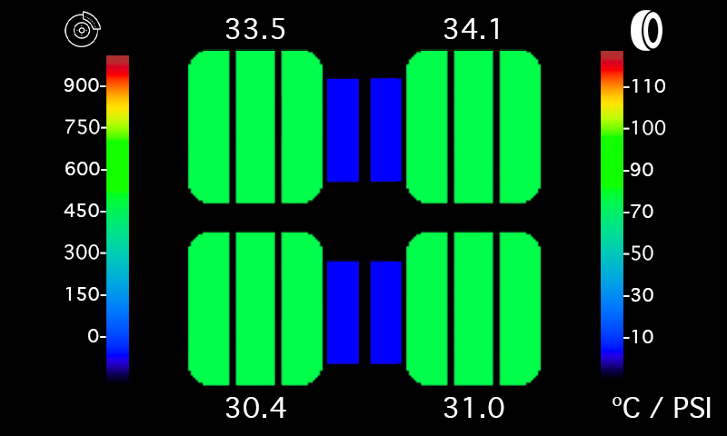

# openTPT – Open Tyre, Pressure & Temp Monitoring System

**openTPT** is an open-source thermal and pressure monitoring widget for motorsport. 
It runs on Raspberry Pi 4 with a HyperPixel touchscreen and visualises real-time tyre temps, brake rotor temps, and tyre pressures — with a full-screen rear-view camera toggle.

---

###Shamelessly 'inspired' by the ACC tyre widget
---

## 🔧 Hardware Requirements

- Raspberry Pi 4
- HyperPixel 4.0 Touchscreen Display
- NeoKey 1x4 (I2C Keypad)
- SparkFun TCA9548A I2C Mux
- MLX90640 Thermal Cameras (x4)
- ADS1115 or ADS1015 ADC (IR brake sensors)
- USB TPMS Receiver (Serial)
- USB UVC Rear Camera

---

## 📋 Features

- 🔥 Per-tyre thermal mapping via MLX90640
- 🛞 Brake rotor temp readings via IR + ADC
- 💨 Tyre pressure + internal temp from TPMS
- 🎥 Toggleable full-screen rear camera view
- 🧠 Designed for future CAN bus + data logging
- 🚗 Built with motorsport use in mind

---

## 🧩 Project Structure

- `main.py` – Launches GUI and polling threads
- `hardware/` – Sensor interfaces and camera toggle
- `gui/` – HyperPixel GUI + NeoKey input
- `assets/` – Icons or overlays for display
- `utils/` – Centralised configs or math utilities

---

## ✅ Tasks Overview

See full scope [here](#phase-1-core-gui--controls)

- [ ] GUI and button input handling
- [ ] Thermal data acquisition and display
- [ ] Brake IR sensor reading and display
- [ ] TPMS pressure display
- [ ] Rear camera toggle
- [ ] CAN output (future)

---

## 🔧 Dependencies

- `pygame` or `tkinter`
- `adafruit-blinka`
- `adafruit-circuitpython-mlx90640`
- `adafruit-circuitpython-neokey`
- `adafruit-circuitpython-tca9548a`
- `adafruit-circuitpython-ads1x15`
- `pyserial`
- `opencv-python` (for rear view, optional)

---

## 📜 License

MIT License
